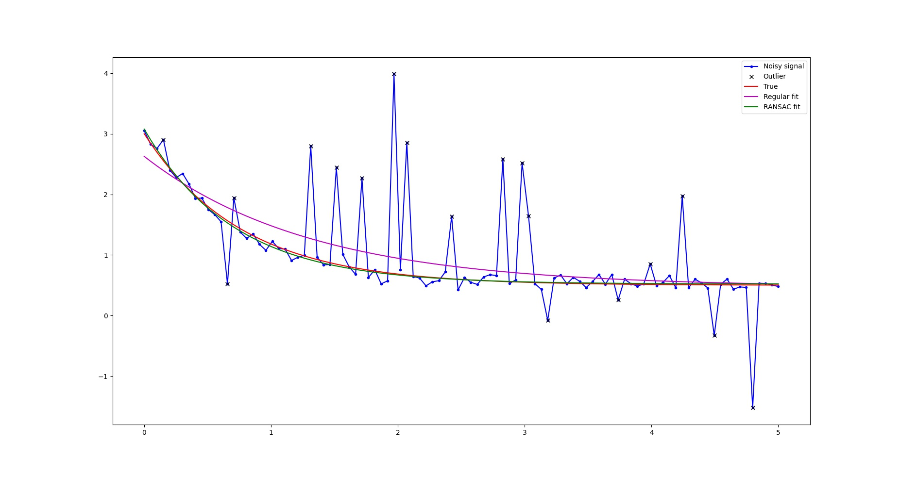
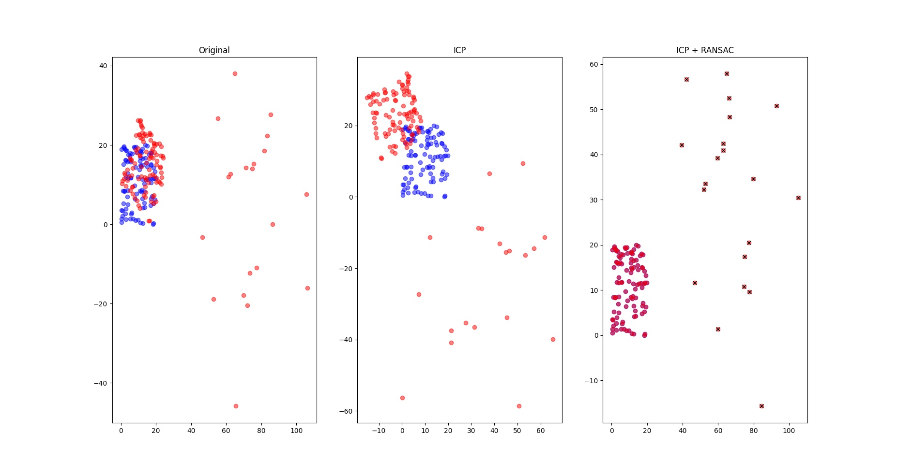
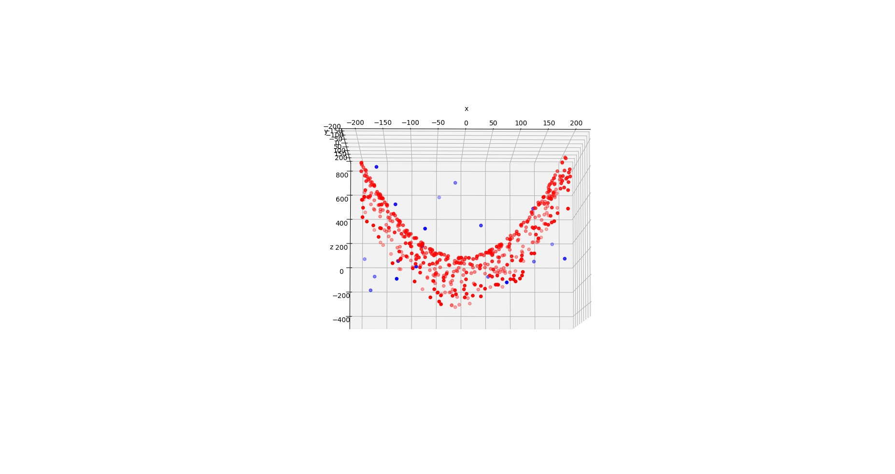

# RANSAC solver

General RANSAC solver using only NumPy as dependency. The implemented RANSAC solver can be used in conjunction
basically with any model fitting method to make it robust against outliers.

## Cloning repo

Clone repo and update submodules (for samples):

```
git clone https://github.com/omyllymaki/ransac-solver.git --recurse-submodules
```

## Requirements

- Python >= 3.6
- Requirements

Install requirements by running (also sample dependencies are installed):

```
pip3 install -r samples/requirements.txt
```

## Usage

To use RANSAC solver, user needs to implement abstract Data and Model classes:

```
class Data(BaseData):
    ...

class Model(BaseModel):
    ...
```

After that, solver can be initialized with the model and used with the data:

```
solver = RansacSolver(model=Model(...), ...)
inlier_indices = solver.solve(Data(...))
```

See samples folder for more detailed usage. Run all the samples by typing

```
./run_samples.sh
```

## Examples

Curve fit with and without RANSAC:

<p align="center">

</p>

ICP fit with and without RANSAC:

<p align="center">

</p>

Polynomial fit with RANSAC:

<p align="center">

</p>